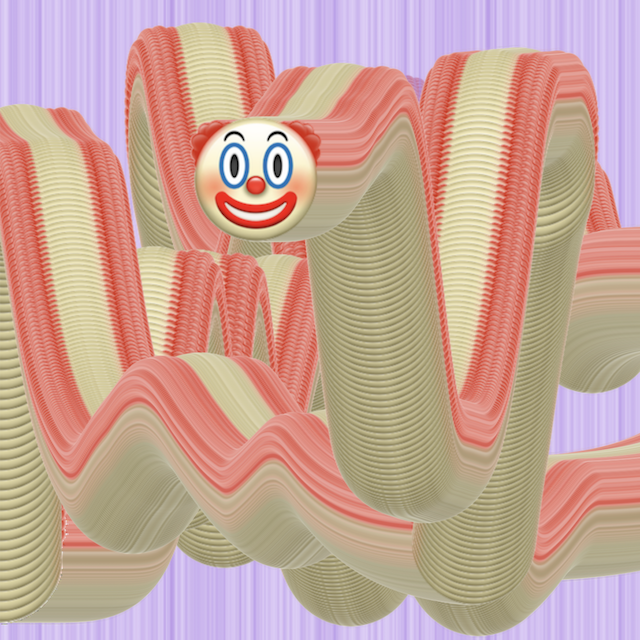

# Exercise 1 - Moving Pictures

## Brief

Create an even more bizarre and surreal collection of moving images by adding your own images and motions to the existing set.



## Challenges

1. Add an image that starts off the left side of the canvas and moves 2 pixels per frame from left to right across the canvas when the program runs.
2. Add an image that is always displayed at the current mouse location.
3. Add an image that follows the mouse but at a different speed from the clown face.

(Optional challenge: add an image that moves across the screen according to a sine wave.)

## Starter Code

`script.js`:
```javascript
/*****************

Exercise 1 - Moving pictures
Pippin Barr

Starter code for exercise 1.
It moves two pictures around on the canvas.
One moves linearly down the screen.
One moves toward the mouse cursor.

******************/

// The image of a clown face
var clownImage;
// The current position of the clown face
var clownImageX;
var clownImageY;

// The transparent image of "felt" that wipes down the canvas
var feltTextureImage;
// The current position of the transparent image of "felt"
var feltTextureImageX;
var feltTextureImageY;


// preload()
//
// Load the two images we're using before the program starts

function preload() {
  clownImage = loadImage("assets/images/clown.png");
  feltTextureImage = loadImage("assets/images/black-felt-texture.png");
}


// setup()
//
// Set up the canvas, position the images, set the image mode.

function setup() {
  // Create our canvas
  createCanvas(640,640);

  // Start the clown image at the centre of the canvas
  clownImageX = width/2;
  clownImageY = height/2;

  // Start the felt image perfectly off screen above the canvas
  feltTextureImageX = width/2;
  feltTextureImageY = 0 - feltTextureImage.height/2;

  // We'll use imageMode CENTER for this script
  imageMode(CENTER);
}


// draw()
//
// Moves the felt image linearly
// Moves the clown face by lerping it toward the mouse location

function draw() {

  // Move the felt image down by increasing its y position
  feltTextureImageY += 1;

  // Move the clown by lerping it toward the mouse
  // Calculate the current distance between the clown and the mouse
  var clownDistance = dist(clownImageX,clownImageY,mouseX,mouseY);
  // Lerp the clown's x and y toward the mouse based on the distance
  clownImageX = lerp(clownImageX,mouseX,1/clownDistance);
  clownImageY = lerp(clownImageY,mouseY,2/clownDistance);

  // Display the two images at their locations
  image(feltTextureImage,feltTextureImageX,feltTextureImageY);
  image(clownImage,clownImageX,clownImageY);
}
```

## Submission

You will submit this exercise as an "Issue" on the course repository here:

## Grading

This exercise is not graded, it's just for practice!
