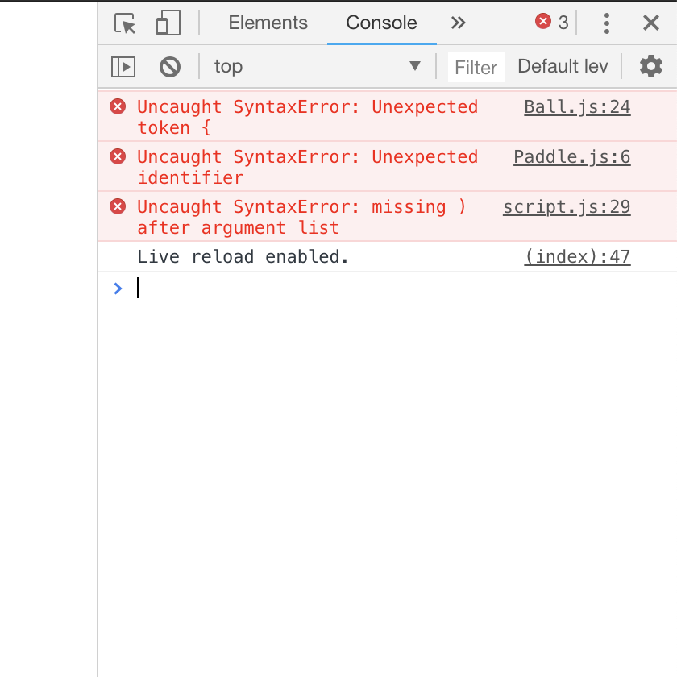

# Exercise 6 - Debugging Pong

__Grade__: 2.5% of final grade (see grading guidelines at bottom)  
__Deadline__: 11:59PM on the day of class on week of 29 October 2018.

## Brief

Debug the provided Broken Pong.

## Learning objectives

- Debugging!

## Commenting your changes clearly

For this exercise you will need to indicate where your fixes were made. In this case place the comment `//////////////// FIXED` on the line before changed code.

## Challenges

This week the challenge is simply to debug broken code. So download the starting code and debug it. This will involve both fixing syntax errors in the code that break the program, and fixing behavioural errors in the code that prevent it from working correctly. Do not just read the code and fix things as you see them, follow this methodical approach to make sure you're really practicing a debugging workflow:

Here are the rules:

0. __Make sure you have your JavaScript console open at all times.__
0. Fix each error/problem __individually__ and then __commit__ and __push__ the change
0. When you find a syntax error, fix it, add the fixed comment, commit it with a message describing the problem and the fix, and push)
0. When you have no syntax errors left and the game runs, determine the current problem with its behaviour, find the cause, fix it, add the fixed comment, commit it with a message describing the problem and fix, and push
0. Keep going until the game plays like the original

This means you will have __one commit per error in the code__ so you absolutely cannot just copy the working code and commit and push it (not that you would). __Make sure you commit each fix individually__ because your grade will be calculated based on the number of fixes you commit. One commit per error.

This also means that __your commits will be in a sensible order__ that represent the process of debugging. We would be able to tell if you just went through comparing the broken version to the original working version, because you would be fixing things in the order they occur in the script files, not in the order you would actually fix them.

## Starting Code

[broken-game-basic-oop-pong.zip](../games/broken-game-basic-oop-pong.zip)

## Submission

You will submit this exercise as a __comment__ on an __Issue__ on the course repository here:

https://github.com/pippinbarr/cart253-2018/issues

(Click on the Issue with the name of the exercise and your section letter and follow the instructions.)

## Grading

There are a set number of errors (both syntax errors and behavioural issues). Your grade will be assigned based on how many of them you identify and correctly fix. The percentage of the errors you find and fix will be used to calculate your grade for this exercise.
