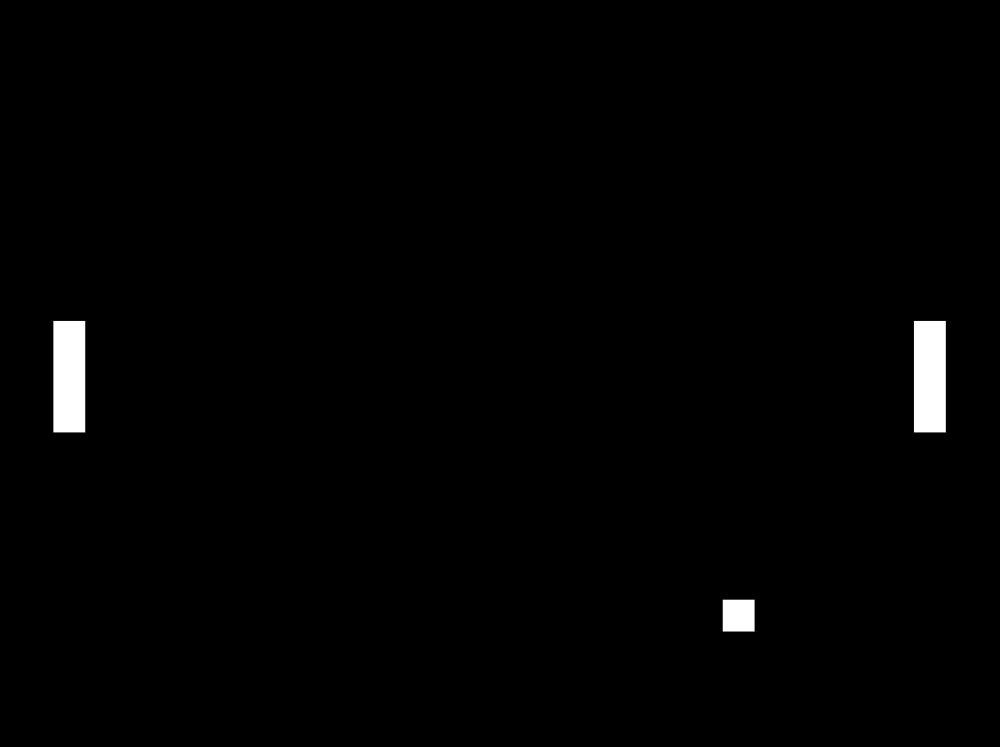

# Project 1 - Build a Better Pong

__Grade__: 20% of final grade (see grading guidelines at bottom)  
__Deadline__: 11:59PM on the day of class on week of 5 November 2018. (Three weeks.)

## Brief

Modify the Pong game to make it a better and more interesting and meaningful game, especially by introducing new classes of objects into the gameplay.

## Learning objectives

- Using Object-Oriented Programming to extend the way a game works
- Continuing to explore how code and experience are connected

## Challenges

As always, begin by downloading the start code ([project2.zip](project2.zip)). Add it to your repository and commit it as "P2: Started project 2". Unlike in an exercise you should practice committing each time you do a unit of work that makes sense to you as a step to getting your whole project done.

- __Improve the game__ in the usual ways we have seen in previous exercises by adding scores, displaying the score, changing the visual and audio aesthetics of the game, etc.
- __Add a title__ to the game that displays before the game starts, let the player start the game by clicking the mouse or hitting a key
- __Add an ending__ to the game when one player reaches 11 points (or some other number you choose), display a game over screen and give the option to reset the game and play again
- Add a new class to the game that create a __new kind of ball__ that the players should avoid when playing, this ball should look different, should move differently, and if the players hit it it should create some disadvantage for them (maybe it makes their paddle smaller, maybe it makes the paddle slower, maybe it makes the paddle move randomly, maybe it reverses the paddle controls, etc.), make sure you have at least one of these objects in the game
- Add a new class to the game that creates a __new kind of object__ different from Paddles and Balls that interacts with the normal type of ball (maybe a kind of food the ball eats to get faster, maybe a portal that teleports the ball somewhere else on the screen, maybe a light-switch that changes the colors of the game to be lighter or darker, etc.), make sure you have at least one of these objects in the game.
- __Use arrays__ to explore the dynamics of having many instances of objects in the game at the same time. (e.g. At minimum have either multiple balls, multiple paddles, or multiples of your new classes - potentially all of these!)

These challenges represent the __minimum__ changes to put into the game. As you work on it, allow yourself think about other things that would be fun and interesting to include in the game and implement them to get a high grade. As always, seek help to get these things done when you need it.

- Remember the Style Guide and make sure you code looks nice!

## Starter Code (Pong)

[project2.zip](project2.zip)

## Submission

You will submit this project as a __comment__ on an __Issue__ on the course repository here:

https://github.com/pippinbarr/cart253-2018/issues

(Click on the Issue with the name of the project and your section letter and follow the instructions.

## Grading

Grading for projects will consider the following categories equally:

- __Runs__ and __implements the challenges required__
- Has __suitable commenting for all added/changed code__
- Includes a minimum of one initial commit of the template code, and commit messages for units of work as you do them (more commits is better), all commits must have a __descriptive message__ prefixed with "P2: "
- Uses __good style__, including the naming of variables and functions and the use of white-space in the code
- Is __well structured__, with new code added in sensible places in sensible orders, and with functions and classes used to make the code modular and repeatable, classes should be in new files

Each element is equally weighted in your the grade for the project and will be graded as follows:

- __Excellent__ (A / 100%) - Meets requirements perfectly
- __Good__ (B / 75%) - Meets requirements with some minor issues
- __Adequate__ (C / 50%) - Meets requirements but with clear issues
- __Poor__ (D / 25%) - Barely meets requirements
- __Non-submission / Unacceptable__ (F / 0%)
